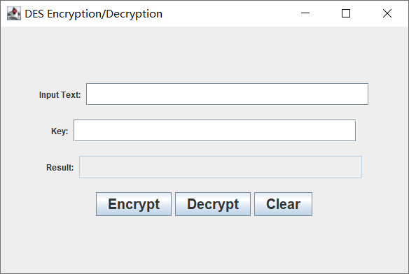
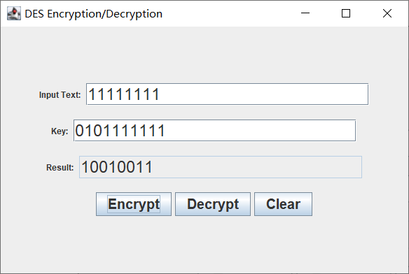
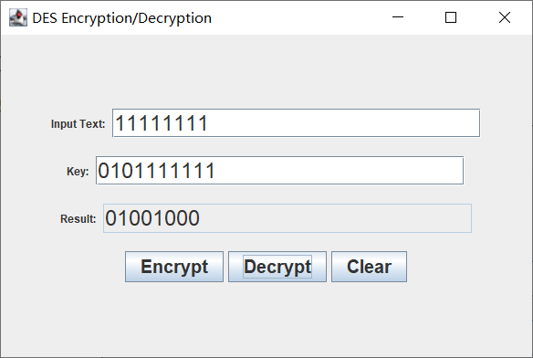
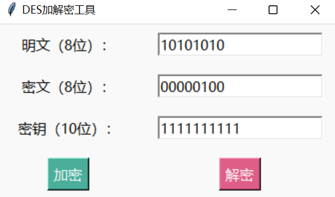
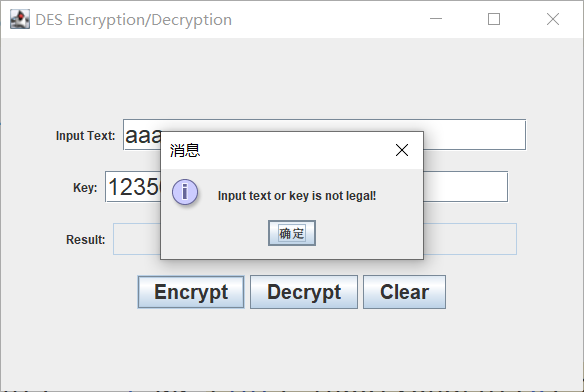
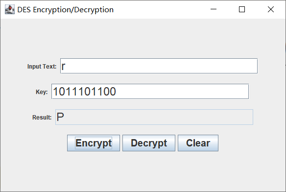
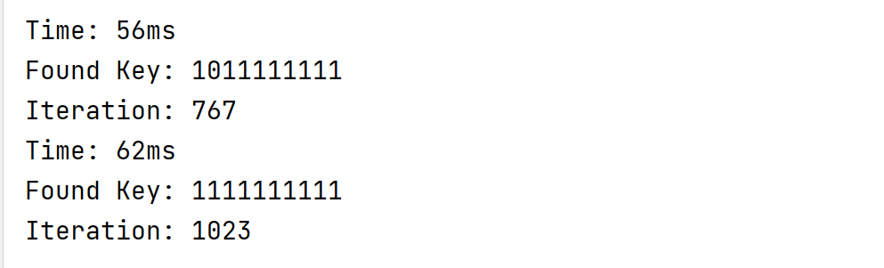
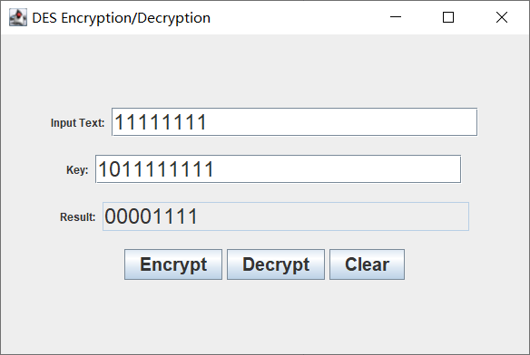
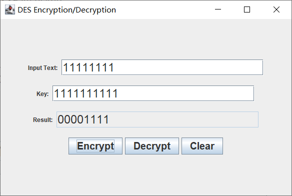
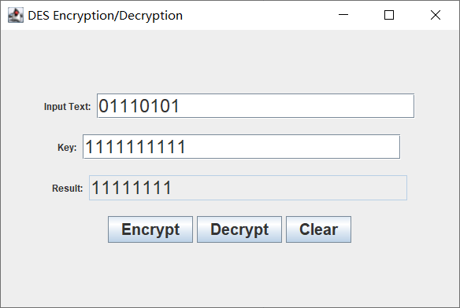

# 信息安全导论 DES加密解密算法

这是一个包含加密和解密功能以及简单图形界面的DES加密实现，明文和密文均为8位二进制数字或1字节字符，而密钥则为10位二进制数字。

### 运行环境
Java-version: JDK 1.8.0_362

编译器：IntelliJ IDEA 2021.1.1 (Ultimate Edition)

### 运行方法
1. 使用IDEA打开项目，等待项目加载完成

2. 找到`src`目录下的`DESEncryption.java`文件，右键点击`Run DESEncryption.main()`，等待编译完成

3. 在弹出的窗口中输入明文或密钥选项，点击`Encrypt` `Decrypt`按钮，即可在弹出的窗口中看到加密/解密后的结果

### 算法实现
算法原理在要求文档中已经非常详细，在此不做赘述

### 关卡测试

#### 关卡一 基本测试

要求：根据S-DES算法编写和调试程序，提供**GUI**解密支持用户交互。输入可以是8bit的数据和10bit的密钥，输出是8bit的密文

本项目采用Java Awt和Swing编写GUI，运行界面如下





在输入框输入对应的名密文和密钥，并且使用按钮加密或解密，即可得到Result

**加密：**



**解密：**




#### 关卡二 交叉测试

要求：考虑到是算法标准，所有人在编写程序的时候需要使用相同算法流程和转换单元(P-Box、S-Box等)，以保证算法和程序在异构的系统或平台上都可以正常运行。设有A和B两组位同学(选择相同的密钥K)；则A、B组同学编写的程序对明文P进行加密得到相同的密文C；或者B组同学接收到A组程序加密的密文C，使用B组程序进行解密可得到与A相同的P。

从贺袁鑫同学的小组获取密文00000100、密钥1111111111，然后由我的项目进行解密，获取到的明文与该小组加密之前的明文相同。多次换取数据尝试后，依旧能匹配，说明交叉测试成功





#### 关卡三 扩展功能

要求： 考虑到向实用性扩展，加密算法的数据输入可以是ASII编码字符串(分组为1 Byte)，对应地输出也可以是ACII字符串(很可能是乱码)


首先检查输入是否合法，在DESUtils中编写相关检查看书，检测是否输入合法

~~~java
    /**
     * 判断输入是否合法
     * @param input
     * @return true or false
     */
    public static boolean isLegalInput(String input) {
        boolean flag = false;
        if(input.matches("[01]{8}")) {
            flag = true;
        }

        if(input.length() == 1 && (int) input.charAt(0) >= 0 && (int) input.charAt(0) <= 127){
            flag = true;
        }

        return flag;

    }
    public static boolean isLegalKey(String key){
        return key.matches("[01]{10}");
    }

~~~


==如果输入不合法，则会有以下提示信息==




将输入的字符先转换为相应的ASCII码，然后再将其转换为二进制格式，最后应用于加密和解密操作。同样地，也可以将加密和解密后的结果转换为字符形式并输出。示例如下：




#### 关卡四 暴力破解

要求：假设你找到了使用相同密钥的明、密文对(一个或多个)，请尝试使用暴力破解的方法找到正确的密钥Key。在编写程序时，你也可以考虑使用多线程的方式提升破解的效率。请设定时间戳，用视频或动图展示你在多长时间内完成了暴力破解。

这是一个非常简单的DES加密实现，仅包含10位密钥，总共有1024种可能性。因此，如果拥有足够多的已知明文和密文对，尝试通过不断使用不同密钥进行加密并与正确密文比对，最终获得密钥并不是一项艰难的任务。当所有明文都能够正确加密时，获得的密钥就可能是其中之一。

通过编写程序可以发现，很快就可以通过暴力破解解决密钥问题，并且运行时间极短



示例代码如下

```java
public class BruteForce {
    public static void main(String[] args) {
        String key = "0101101010";
        String plaintext1 = "11111111";
        String plaintext2 = "11111110";
        String plaintext3 = "11111101";
        String plaintext4 = "11111100";
        String ciphertext1 = "00001111";
        String ciphertext2 = "01110110";
        String ciphertext3 = "01011010";
        String ciphertext4 = "01111001";

        long l = System.currentTimeMillis();
        for (int i = 0; i < 1024; i++) {
            String binary = String.format("%10s", Integer.toBinaryString(i)).replace(' ', '0');

            String newKey = binary;

            String newCiphertext1 = DES.encrypt(plaintext1, newKey);
            String newCiphertext2 = DES.encrypt(plaintext2, newKey);
            String newCiphertext3 = DES.encrypt(plaintext3, newKey);
            String newCiphertext4 = DES.encrypt(plaintext4, newKey);

            if (newCiphertext1.equals(ciphertext1) && newCiphertext2.equals(ciphertext2) && 		       
                newCiphertext3.equals(ciphertext3) && newCiphertext4.equals(ciphertext4)
                     ) {
                long l2 = System.currentTimeMillis();
                System.out.println("Time: " + (l2 - l) + "ms");
                System.out.println("Found Key: " + newKey);
                System.out.println("Iteration: " + i);
            }
        }
    }
}
```


#### 关卡五 封闭测试

要求：根据第4关的结果，进一步分析，对于你随机选择的一个明密文对，是不是有不止一个密钥Key？进一步扩展，对应明文空间任意给定的明文分组$P_n$，是否会出现选择不同的密钥$K_i\neq K_j$加密得到相同密文$C_n$的情况？


##### 1.同组明密文是否存在多个密钥






存在多个密钥使得加密结果相同


##### 2.不同明文+不同密钥 加密后得到相同密文




仍然可以得到相同结果